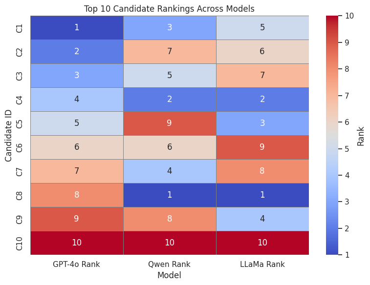
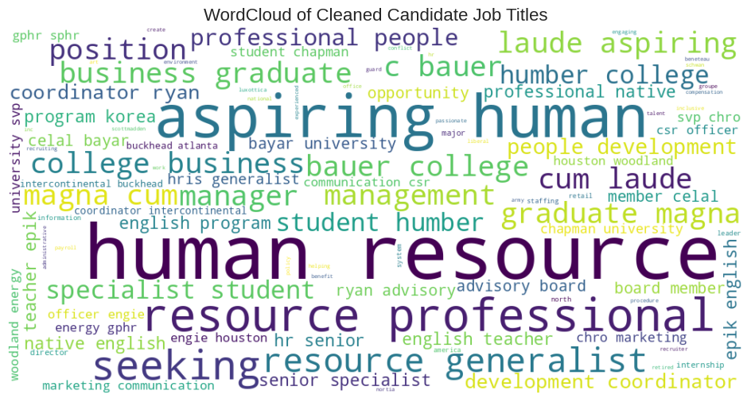
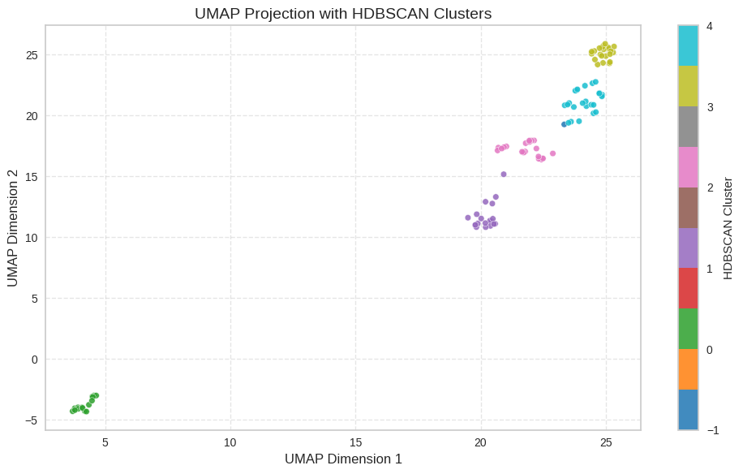

# Potential Talents: Beyond Keywords with a Multi-LLM Candidate Ranking Engine
> An [Apziva](https://www.apziva.com) AI Residency Project


In today's competitive talent market, recruiters are inundated with applications, yet traditional screening methods that rely on rigid keyword matching often overlook high-potential candidates. This repository documents a comprehensive, two-part project designed to solve this problem. Part one establishes a robust baseline using classical machine learning for quantitative scoring and clustering. Part two evolves this approach, leveraging a sophisticated, multi-agent LLM system for nuanced, human-like candidate evaluation. Together, they demonstrate a complete journey from statistical analysis to generative AI reasoning.
---

## 🧠 Project Versions

### 🔹 Version 2: POTENTIAL_TALENTS_2_LLM_Powered_Candidate_Ranking (**Current Focus**)

This advanced pipeline enhances the ranking process by introducing **LLMs** to reason about candidate fit:
- Leveraging on a "Committee of AIs": **GPT-4o**, **Qwen**, & **LLaMa-2** to generate nuanced rankings with justifications.
- Implementing a Tournament-Style Ranking strategy to process candidates in batches, ensuring high-accuracy results from all models.
- Simulating Recruiter Feedback with a "human-in-the-loop" reranking feature based on a starred or ideal candidate.
- Validating LLM Reasoning using unsupervised clustering (UMAP + HDBSCAN) to ensure a diverse and relevant shortlist.
- Fostering Transparency through **thresholding and rationale analysis**

📝 Notebook: [`notebook/POTENTIAL_TALENTS_2_LLM_Powered_Candidate_Ranking.ipynb`](notebook/POTENTIAL_TALENTS_LLM_2_Powered_Candidate_Ranking.ipynb)

---

### 🔹 Version 1: Scoring-Based Candidate Ranking

The initial pipeline focused on classical NLP and ML techniques to rank candidates:
- Scoring candidates on lexical relevance using **TF-IDF**
- Generating deep semantic embeddings using a suite of models including **S-BERT**, **Word2Vec**, **GloVe**, and **FastText**.
- Identifying distinct talent pools by clustering candidates with KMeans (on **TF-IDF**) and the **UMAP** + **HDBSCAN** pipeline (on **S-BERT**).
- Training and deploying a **Random Forest classifier** on simulated labels to predict a quantitative 'fit score'.

📝 Notebook: [`notebook/POTENTIAL_TALENTS_Scoring_Based_Candidate_Ranking.ipynb`](notebook/POTENTIAL_TALENTS_Scoring_Based_Candidate_Ranking.ipynb)

---

## 🚀 Project Objectives (Both Versions)

- Predict candidate-role fit using structured metadata
- Rank candidates using both similarity scoring and LLM reasoning
- Adapt to recruiter feedback via reranking logic
- Surface talent segments through unsupervised clustering
- Deliver a justified, auditable shortlist

---

## 🛠️ Tech Stack

- **Languages & Environment:**
  - Python 3.11
  - Google Colab Pro (A100 & L4 GPUs)

- **Libraries & Frameworks:**
  - `scikit-learn` – ML models, pipelines, evaluation
  - `sentence-transformers` – S-BERT embeddings
  - `transformers` – LLM integration (Qwen, LLaMa via Hugging Face)
  - `gensim` – Pretrained embeddings (Word2Vec, FastText)
  - `torchtext` – GloVe integration
  - `nltk` – Text preprocessing for TF-IDF and embeddings
  - `umap-learn`, `hdbscan` – Dimensionality reduction & clustering
  - `matplotlib`, `seaborn` – Visualizations
  - `PyTorch` – Backend for transformers, S-BERT, and deep embeddings

- **Embeddings Used:**
  - TF-IDF
  - Sentence-BERT
  - GloVe (via torchtext)
  - Word2Vec & FastText (via gensim)

- **LLMs Used:**
  - GPT-4o (OpenAI)
  - Qwen-1.8B (Alibaba, Hugging Face)
  - LLaMa-2-7B (Meta, Hugging Face)

---

## 📁 Repository Structure

```
notebook/
├── POTENTIAL_TALENTS_Scoring_Based_Candidate_Ranking.ipynb ✅ (Version 1) 
├── POTENTIAL_TALENTS_2_LLM_Powered_Candidate_Ranking.ipynb  ✅ (Version 2)

figures/
├── llm_ranking_heatmap.png
├── gpt4o_vs_sbert_scatter.png
├── wordcloud.png
├── cluster_map.png
```

---

## 📊 Visual Insights

### 🔹 LLM-Powered Pipeline

#### 🔢 Model Ranking Heatmap (GPT-4o vs Qwen vs LLaMA)


#### 🎯 Fit vs Similarity: GPT-4o vs S-BERT


---

### 🔹 Scoring-Based Pipeline (V1)

#### ☁️ NLP Snapshot: Role-Relevant Terminology 


#### 🧭 UMAP Projection with HDBSCAN Clusters


---

## 🏆 Key Outcomes & Impact
- **Demonstrated Two Complementary Methodologies:** Successfully architected and implemented two distinct, end-to-end pipelines: a **scoring-based system (V1)** that excels at quantitative analysis and a **reasoning-based LLM system (V2)** that provides qualitative, human-like insights.

- **Achieved Full-Funnel Automation:** Both pipelines transform an initial pool of over 100 candidates into a final, data-driven shortlist, proving the viability of automated talent screening to significantly reduce manual effort.

- **Generated Both Quantitative & Qualitative Insights:** The project delivers both numerical 'fit scores' (from V1's classifier) and rich, narrative 'justifications' (from V2's LLMs), providing a holistic and defensible view for hiring managers.

- **Enhanced Decision-Making:** The final output is more than just a ranked list; it's a rich, multi-faceted analysis of the talent pool, complete with model-generated rationale and cluster-based insights for strategic hiring.
  
---

## 🧗‍♂️ Project Reflection
This two-part journey mirrors how modern AI can evolve recruitment:

- The **first version** grounded us in robust scoring and clustering, surfacing candidates based on textual and semantic alignment using classical NLP techniques.

- The **second version** embraced LLMs to reason about candidate fit, justify decisions, and simulate recruiter feedback — leading to a consensus-driven shortlist supported by both data and domain context.

Together, these approaches demonstrate how AI can go *beyond keywords* — from mechanical scoring to contextual reasoning — ultimately producing a **justified, auditable shortlist of top candidates** from over 100 profiles.

...

## 🔗 Resources

- [GPT-4o by OpenAI](https://openai.com/index/gpt-4o/)
- [Hugging Face Transformers](https://huggingface.co/docs/transformers/index)
- [CUDA Toolkit (NVIDIA)](https://developer.nvidia.com/cuda-toolkit)
- [LLaMa-2 (Meta)](https://ai.meta.com/llama/)
- [Qwen-1.8B (Alibaba)](https://huggingface.co/Qwen/Qwen-1_8B)

These libraries and tools were instrumental in building the LLM-powered candidate ranking engine.

---

## 🧪 Getting Started

```bash
# 1. Clone the repo
git clone https://github.com/AlvinSMoyo/NLFxbI8E2LD5JDPY.git

# 2. Install dependencies
pip install -r requirements.txt

# 3. Open the desired notebook
jupyter notebook notebook/POTENTIAL_TALENTS_2_LLM_Powered_Candidate_Ranking.ipynb
# or
jupyter notebook notebook/POTENTIAL_TALENTS_Scoring_Based_Candidate_Ranking.ipynb
```

---


