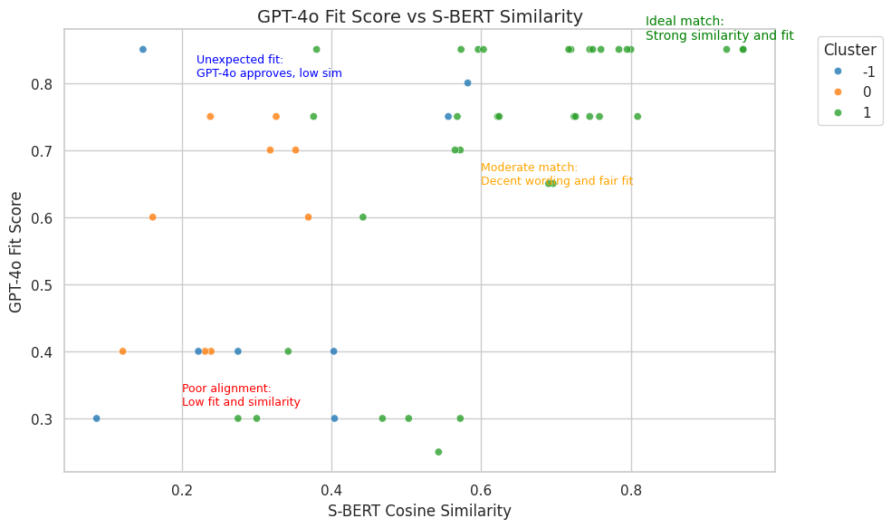

# Potential Talents: Beyond Keywords with a Multi-LLM Candidate Ranking Engine


This repository tackles the challenge of identifying the most suitable job candidates from a large applicant pool — a process often limited by keyword matching and prone to bias. It showcases two complementary solutions I developed during my **Apziva AI Residency:** one using classical similarity scoring methods, and the other leveraging large language models (LLMs) to reason about candidate fit in a more nuanced, human-like manner.
---

## 🧠 Project Versions

### 🔹 Version 2: POTENTIAL_TALENTS_LLM_Powered_Candidate_Ranking (**Current Focus**)

This advanced pipeline enhances the ranking process by introducing **LLMs** to reason about candidate fit:
- Fit and justification generation using **GPT-4o**, **Qwen-1.8B**, and **LLaMa-2-7B**
- Multi-model **ranking and reranking consensus**
- **Human-in-the-loop** simulation via starred candidate reranking
- **Clustering** with UMAP + HDBSCAN for diversity-aware shortlisting
- Transparent **thresholding and rationale analysis**

📝 Notebook: [`notebook/POTENTIAL_TALENTS_LLM_Powered_Candidate_Ranking.ipynb`](notebook/POTENTIAL_TALENTS_LLM_Powered_Candidate_Ranking.ipynb)

---

### 🔹 Version 1: Scoring-Based Candidate Ranking

The initial pipeline focused on classical NLP and ML techniques to rank candidates:
- **TF-IDF** lexical scoring
- **S-BERT**, **Word2Vec**, **GloVe**, and **FastText** semantic embeddings
- **Clustering** via KMeans (TF-IDF) and UMAP + HDBSCAN (S-BERT)
- A **Random Forest classifier** trained on simulated fit labels

📝 Notebook: [`notebook/POTENTIAL_TALENTS_Scoring_Based_Candidate_Ranking.ipynb`](notebook/POTENTIAL_TALENTS_Scoring_Based_Candidate_Ranking.ipynb)

---

## 🚀 Project Objectives (Both Versions)

- Predict candidate-role fit using structured metadata
- Rank candidates using both similarity scoring and LLM reasoning
- Adapt to recruiter feedback via reranking logic
- Surface talent segments through unsupervised clustering
- Deliver a justified, auditable shortlist

---

## 🛠️ Tech Stack

- **Language**: Python 3.x
- **Libraries**: `pandas`, `scikit-learn`, `nltk`, `sentence-transformers`, `umap-learn`, `hdbscan`, `matplotlib`, `seaborn`, `transformers`, `openai`
- **Embedding Models**: Sentence-BERT, Word2Vec, GloVe, FastText
- **LLMs**: GPT-4o (OpenAI), Qwen-1.8B (Alibaba), LLaMa-2-7B (Meta)
- **Clustering**: KMeans (TF-IDF) and UMAP + HDBSCAN (S-BERT)

---

## 📁 Repository Structure

```
notebook/
├── POTENTIAL_TALENTS_Scoring_Based_Candidate_Ranking.ipynb ✅ (Version 1) 
├── POTENTIAL_TALENTS_LLM_Powered_Candidate_Ranking.ipynb  ✅ (Version 2)

figures/
├── llm_ranking_heatmap.png
├── gpt4o_vs_sbert_scatter.png
├── tfidf_similarity_matrix.png
├── kmeans_cluster_map.png
```

---

## 📊 Visual Insights

### 🔹 LLM-Powered Pipeline

#### 🔢 Model Ranking Heatmap (GPT-4o vs Qwen vs LLaMA)


#### 🎯 Fit vs Similarity: GPT-4o vs S-BERT


---

### 🔹 Scoring-Based Pipeline (V1)

#### 📐 TF-IDF Similarity Matrix


#### 🧭 KMeans Clustering of TF-IDF Profiles


---

## 🧗‍♂️ Project Reflection
This two-part journey mirrors how modern AI can evolve recruitment:

- The **first version** grounded us in robust scoring and clustering, surfacing candidates based on textual and semantic alignment using classical NLP techniques.

- The **second version** embraced LLMs to reason about candidate fit, justify decisions, and simulate recruiter feedback — leading to a consensus-driven shortlist supported by both data and domain context.

Together, these approaches demonstrate how AI can go *beyond keywords* — from mechanical scoring to contextual reasoning — ultimately producing a **justified, auditable shortlist of top candidates** from over 100 profiles.

...

## 🔗 Resources

- [GPT-4o by OpenAI](https://openai.com/index/gpt-4o/)
- [Hugging Face Transformers](https://huggingface.co/docs/transformers/index)
- [CUDA Toolkit (NVIDIA)](https://developer.nvidia.com/cuda-toolkit)
- [LLaMa-2 (Meta)](https://ai.meta.com/llama/)
- [Qwen-1.8B (Alibaba)](https://huggingface.co/Qwen/Qwen-1_8B)

These libraries and tools were instrumental in building the LLM-powered candidate ranking engine.

---

## 🧪 Getting Started

```bash
# 1. Clone the repo
git clone https://github.com/AlvinSMoyo/NLFxbI8E2LD5JDPY.git

# 2. Install dependencies
pip install -r requirements.txt

# 3. Open the desired notebook
jupyter notebook notebook/POTENTIAL_TALENTS_LLM_Powered_Candidate_Ranking.ipynb
# or
jupyter notebook notebook/Scoring_Based_Candidate_Ranking.ipynb
```

---


